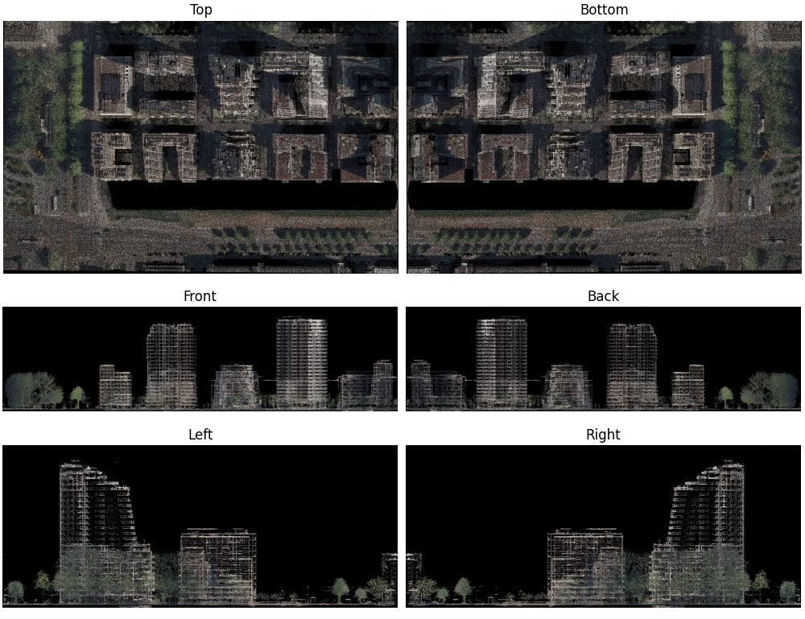
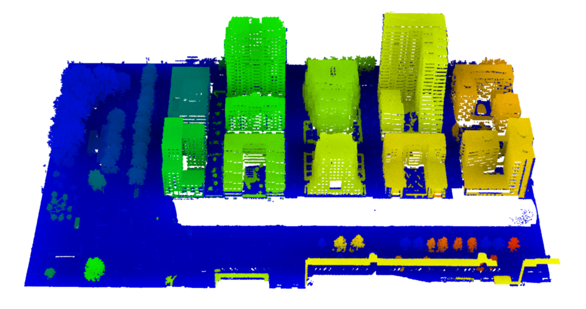

# Summary

`Segment-Lidar` is a Python package for automatic unsupervised segmentation of aerial LiDAR data. It proposes an image-based approach for segmenting aerial point clouds using `Segment-Anthing Model (SAM)` package from [Meta AI](https://github.com/facebookresearch).

The API provides functions and classes to define the segmentation model and its parameters, and also to handle transformation between 3D point clouds and images. The package also relies on other dependencies that make use of `SAM`. This includes the `Segment-Geospatial` package from [Open Geospatial Solutions](https://github.com/opengeos) for segmenting geospatial data and the `Grounded-SAM` package from [The International Digital Economy Academy Research (IDEA-Research)](https://github.com/IDEA-Research) that combines `SAM` with `GroundingDINO` to detect and segment anything with text prompts. The `GroundingDINO` package was introduced by IDEA-Research as an implementation of the paper "Grounding DINO: Marrying DINO with Grounded Pre-Training for Open-Set Object Detection".

For optimization purposes, `Segment-Lidar` enables using `Fast Segment Anything Model (FastSAM)` as an alternative to `SAM` original API. The `FastSAM` is a Convolutional Neural Network (CNN) `SAM` that was trained using only 2% of the `SA-1B` dataset published by `SAM` authors. It achieves comparable performance at 50x higher run-time speed.

# Statement of need

The swift advancement of data acquisition technologies like LiDAR sensors and depth cameras has led to the widespread use of 3D point cloud data, which, in turn, has started a growing interest among researchers in the field of 3D scene comprehension. However, the comprehension of such unstructured, disordered and spare point clouds yields technical challenges [@su:2022].

Recently, due the effective use of deep learning models in computer vision applications, many works focused on developing image segmentation approaches using deep learning models [@shevrin:2020].

Another advantage of image segmentation models is that they require less computational and data resources for finetuning in order to obtain competitive performance on downstream tasks [@chenfeng:2021].

@kirillov:2023 introduced the Segment Anything Model (SAM) for image segmentation. It has three three components: an image encoder, a flexible prompt encoder, and a fast mask decoder. The model was trained on SA-1B dataset that consists of 11 millions  licensed and privacy respecting images and 1.1 billion high-quality segmentation masks.

SAM served as the basis for the development of many other packages. `Segment-Geospatial` is one of these open-source packages that was designed to segment geospatial data using Segment Anything Model [@wu:2023].


# Overview of the method

The idea behind using `SAM` is to automatically identify and separate different instances in 3D LiDAR data through automated image segmentation. The process can be divided into four main steps:

## Step 1: Ground filtering using Cloth Simulation Filter [Optional]

The ground filtering is optional but preferred for aerial LiDAR data with top viewpoint. It serves two primary purposes that significantly enhance the accuracy and reliability of object detection and segmentation. First, ground filtering helps improve the detection of objects within the image by eliminating the interference of ground points. This is especially vital for identifying objects such as buildings, vehicles, and infrastructure, as it allows for a clearer focus on target objects against a clutter-free background. Second, ground filtering prevents the projection of segmentation results onto ground points, especially for tall structures like trees and poles.

Our package uses the Cloth Simulation Filter (CSF) to separate the ground points from non-ground points (Figure 1). The algorithm was proposed by @zhang:2016 as an implementation of the Cloth Simulation algorithm used in 3D computer graphics to simulate fabric attached to an object.

## Step 2: Projection of the 3D point cloud into a two-dimensional image

This projection can be based on various views, including cubic views (top, bottom, left, right, front, back) and panoramic views (360°).

1. **Cubic Projection**:

In a cubic projection, each face of the cube represents a different view (\autoref{fig:cubicview}). The 3D coordinates (X, Y, Z) are projected onto the 2D coordinates (u, v) on the image plane.

As shown in Figure 1, for the top face:

`u` represents the horizontal axis in the image.
`v` represents the vertical axis in the image.

The projection equations for the top face are then:

$$u = X$$
$$v = Y$$

Similarly, these equations are adapted for other faces of the cube, adjusting the coordinates based on the view.



2. **Panoramic View**:

Panoramic projections capture a full 360-degree view around a point. A common panoramic projection is the equirectangular projection. In this projection, the 3D spherical coordinates ($\Theta$, $\Phi$, $\rho$) are mapped onto 2D coordinates (u, v) on the image plane.

$\Theta$ represents the azimuthal angle (longitude).
$\Phi$ represents the polar angle (latitude).
$\rho$ represents the radial distance from the center.

The equirectangular projection equations are:

$$u = w\times \frac{\Theta - \Theta_{min}}{\Theta_{max} - \Theta_{min}}$$
$$v = h\times \frac{\Phi - \Phi_{min}}{\Phi_{max} - \Phi_{min}}$$

$\Theta_{min}$ and $\Theta_{max}$ are the minimum and maximum azimuthal angles, and $\Phi_{min}$ and $\Phi_{min}$ are the minimum and maximum polar angles. `w` and `h` are the dimensions of the image.


## Step 3: Inference on the generated image

The Segment-Anything Model (SAM) was used to generate masks for all objects in the resulting image [@kirillov:2023]. Additionally, Segment-Geospatial [@wu:2023] is implemented to leverage SAM for geospatial analysis by enabling users to achieve results with minimal parameters tuning. The results for sample data are illustrated in \autoref{fig:inference}.


## Step 4: Reprojection of results on the 3D point cloud

In the final step of our methodology, we seamlessly reproject the instance segmentation results onto the original point cloud (\autoref{fig:results}). This associates each point in the cloud with its corresponding segment label obtained from the 2D image segmentation. Mathematically, this process involves identifying the 2D image coordinates for each point in the point cloud, which can be achieved through reverse projection of the cubic or panoramic projection. Once the corresponding 2D image coordinates are identified, we assign the segment label from the segmentation map to the corresponding point in the cloud.



# Use of the package

The package is available as a Python library and can be installed directly from [PyPI](https://pypi.org/project/segment-lidar/). We recommend using `Python>=3.9`. It is also required to install [PyTorch](https://pytorch.org/) before installing `segment-lidar`.

The easiest way to install the package in a Python environment is tu run the following command:

```bash
pip install segment-lidar
```

It is also possible to install it from source by running these commands:

```bash
git clone https://github.com/Yarroudh/segment-lidar
cd segment-lidar
python setup.py install
```

The usage of `Segment-Lidar` is comprehensively detailed in the accompanying documentation, which includes tutorials providing step-by-step instructions.

The package also offers an API comprising classes and functions to ensure interoperability with other libraries for numerical computing, image processing and machine learning.

# References